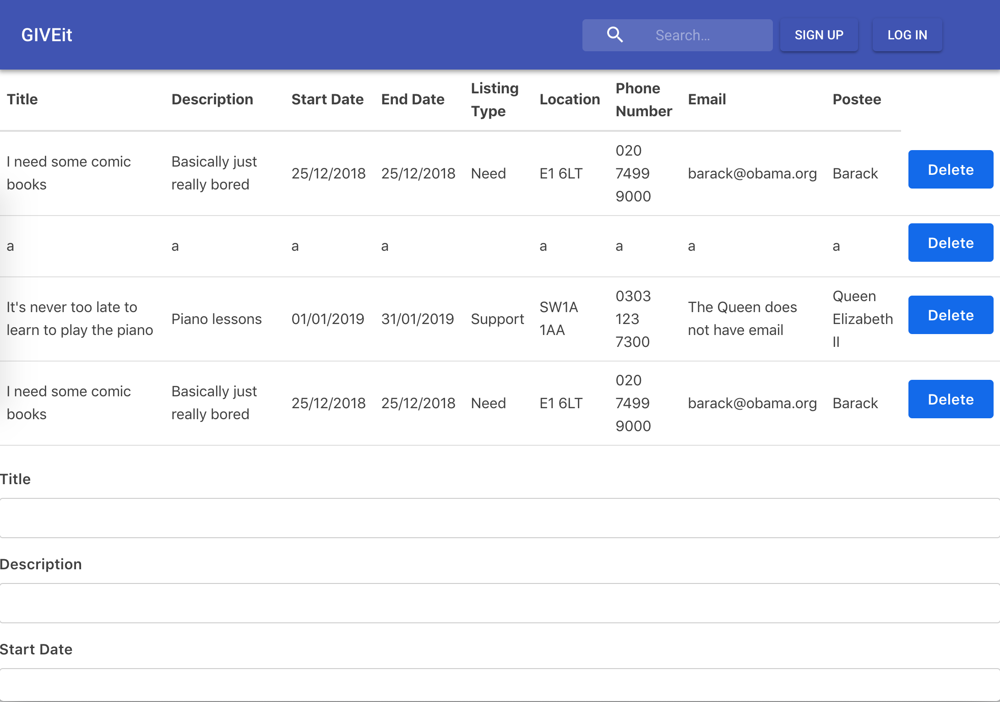
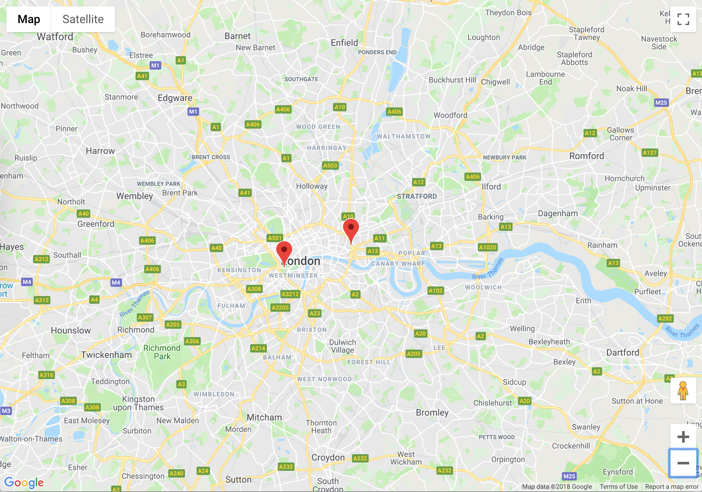

# GIVEit-frontend  [](https://travis-ci.org/becc-mu/GIVEit-frontend)

For our 2-week final project at Makers, we built GIVEit.

GIVEit is a social platform for connecting people in need with people offering services that can help them.

The application consists of a [Rails API](https://github.com/becc-mu/GIVEit-backend) and a ReactJS front-end, this repo houses the latter.

Here is a link to our app in production: http://giveit.surge.sh/

## Features

Our app has the following features:
 - Creating, showing, and deleting listings
 - Communicating with the GIVEit backend API via JSON, persisting the data in a database
 - Converting a listing address to a latitude/longitude pair via the Google Maps Geocoding API
 - Showing a marker on Google Maps using the Google Maps JavaScript API
 - Showing an info box on Google Maps using the Google Maps JavaScript API

## Initial User Stories

These are the user stories we wrote to get ourselves started with the project and reach our MVP (we completed this by the end of the second day).

```
As a user
So that I can make a request for help
I want to create a listing

As a user
So that I can find help on a map
I want to see the listing location on Google Maps

```

## User interaction diagram
// TODO

## Our learning documentation
- [Here](https://trello.com/b/fCE5cFQb/giveit) is our card wall for the project
- [Here](https://github.com/MugeHasilci/GIVEit-frontend/wiki) is our learning log that we updated each day.

## Installing and running the app locally

**
Please note: if running the application locally, you must have a Google Maps API key set in `.env.local`. This is to prevent unauthorized use of our Google Maps API developer key. If you would like to provide your own key, store the key in `.env.local`, and name the key `REACT_APP_MAPS_API_KEY`. See the [React docs](https://facebook.github.io/create-react-app/docs/adding-custom-environment-variables) for more information.
**

First, clone this repository. Then check for dependencies with npm or yarn, and run a development server:

```bash
> yarn
> yarn start # Start the server at localhost:3000
```

## Tests

To run integration tests, first use npm or yarn to run Cypress and pick a test to run, or run all tests:
```bash
> yarn cypress:open
```
To run unit tests, use npm or yarn to run the React test script, e.g. to run all tests:
```bash
> yarn test a
```

## Contributing

Feel free to open a GitHub issue with anything you notice. Fork then clone the repository if you want to make any changes, then make a pull request with your changes. Changes must be approved in a pull request before being merged into the master branch.

## Early version screenshots (not final)




## Team Members
[Muna Hussein](https://github.com/MHUS25) |
[Muge Hasilci](https://github.com/MugeHasilci) |
[Henry Cooksley](https://github.com/hnryjmes)  |
[Ryan Clark](https://github.com/RyanWolfen7)  |
[Rebecca Mulugeta](https://github.com/becc-mu)
